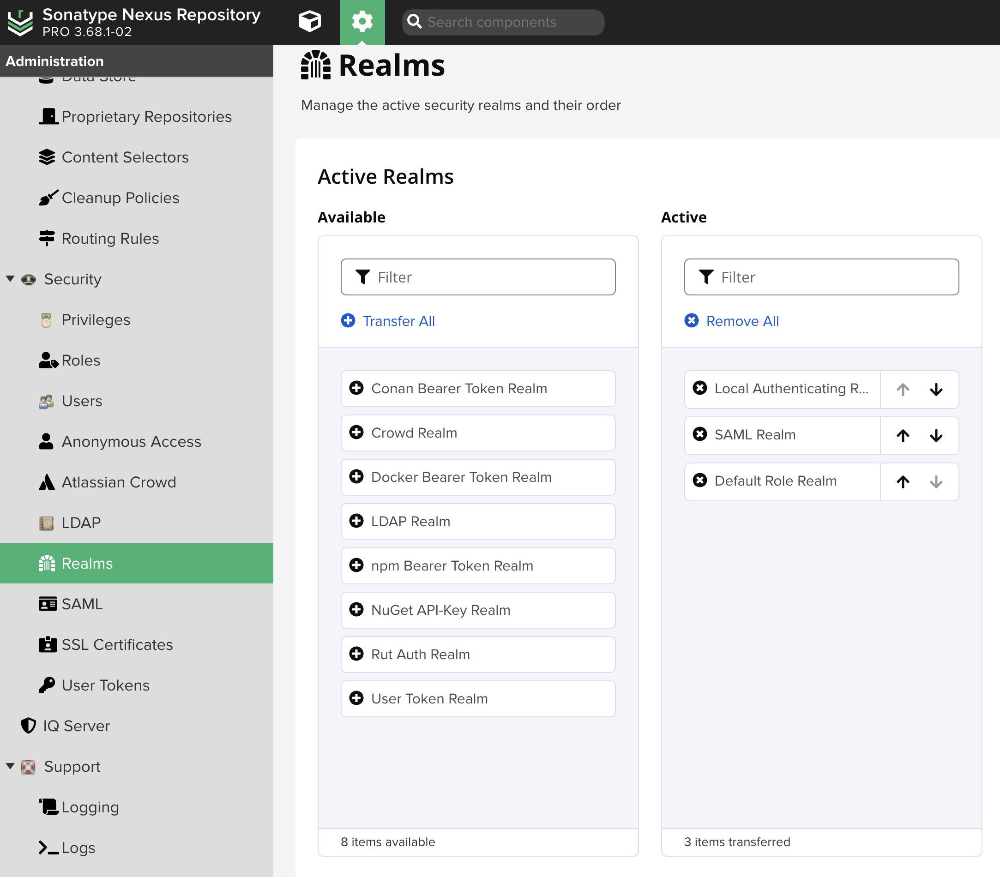
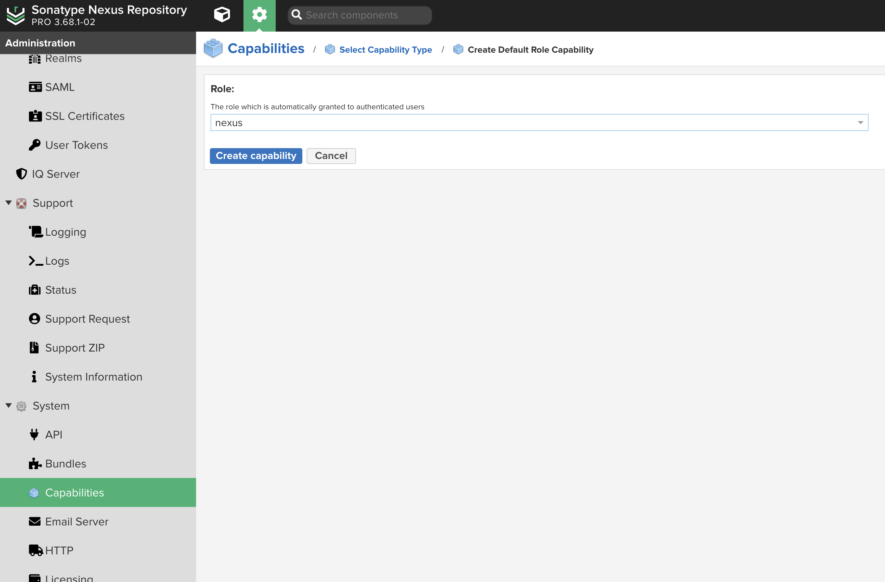
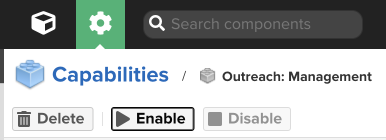

# uds-package-nexus
UDS Nexus Zarf Package

# uds-capability-nexus
Bigbang [Nexus Repository Manager](https://repo1.dso.mil/big-bang/product/packages/nexus)

## Deployment Prerequisites

#### General

- Create `nexus` namespace
- Label `nexus` namespace with `istio-injection: enabled`

#### Database

- A Postgres database is running on port `5432` and accessible to the cluster
- This database can be logged into via the username configured with `NEXUS_DB_USERNAME`. The default is `nexus`.
- This database instance has a psql database created matching the configuration of `NEXUS_DB_NAME`. The default is `nexusdb`.
- Configure the `NEXUS_DB_PASSWORD` to match your database.
- The database user has read/write access to the above mentioned database

#### Pro License
- Provide your base64 encoded license file via the Zarf deploy time variable `NEXUS_LICENSE_KEY`.
- External DB configuration requires a valid Nexus license to use the external DB configuration. If a license is not provided Nexus will default to the OSS version and will use an internal H2 DB.
- SSO requires a valid Nexus License. With a valid license you can enable SSO via the Zarf deploy time variable `NEXUS_SSO_ENABLED`

#### NEXUS_VM_PARAMS
- This package provides the same default as the upstream registry1 chart. You may need to update these to your needs.

`-Dcom.redhat.fips=false -Xms2703M -Xmx2703M -XX:MaxDirectMemorySize=2703M -XX:+UnlockExperimentalVMOptions -XX:+UseContainerSupport -Djava.util.prefs.userRoot=/nexus-data/javaprefs`

#### Additional Notes
##### Access Control
- Information about configuring access controls and related topics such as realms, privileges, roles, default roles, ect can be found [here](https://help.sonatype.com/en/access-control.html#related-topics)

- To assign a Default Role to an authenticated user follow these steps.
  - Ensure the Default Role Realm is Active
  
  - Create a Capability using the capability type *Default Role* and the role you would like to use for authenticated users
  

##### Disconnected Environments
- When deploying in a disconnected environment, you will want to disable the outreach management capability.

